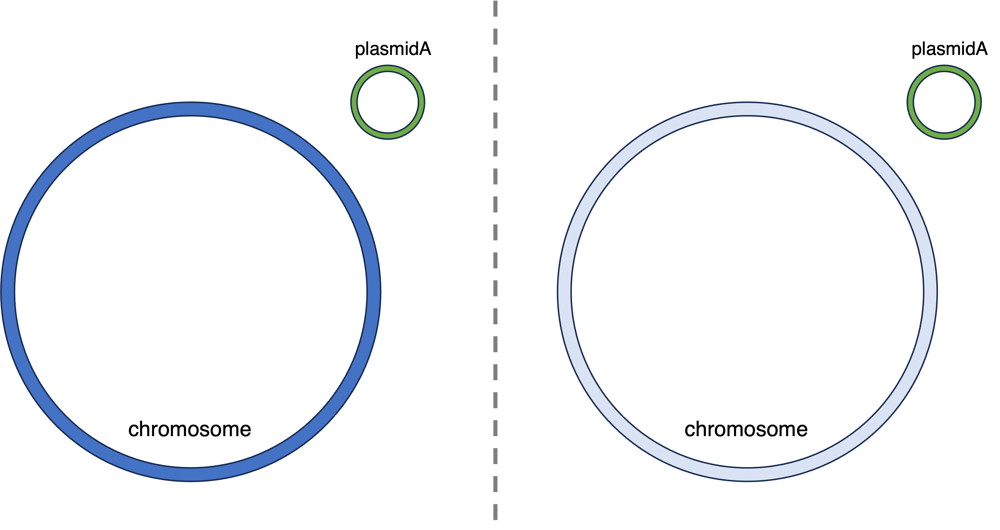

# Cell organisation format

## Objective
To describe the composition and organisation of bacterial genomes accounting for the distribution of mobile genetic elements.

## Motivation
Long-read sequencing has enabled the description of the complete genomic composition of bacterial cells and the identification of the location of its mobile genetic elements. Through hybrid assemblies, we are capable of characterizing complete plasmids and accurately describing transposons, previously a challenging task due to its repetitive nature. As we are able to better understand the genomic organization of bacterial cells, we need a common language to describe the location of its mobile genetic elements in the context of all its replicons. For this purpose, we present a computer-friendly format, based on the Newick format for trees, which aims to be readable to the human eye.

## Definition

Describe main format

## Annotation

Describe the ability to annotate using `:`

### Units

* `` : cell ***(do we need this?)***
* `()` : chromosome
* `{}` : plasmid
* `<>` : transposon
* `[]` : integron
* `` : phage

## Examples

* A cell with a single chromosome carrying an integron


```
(chromosome[integron])
```

* A cell with a single chromosome and single plasmid


```
(chromosome){plasmid}
```

* A cell with a single chromosome, a single plasmid, and another copy of the plasmid integrated in the chromosome


```
(chromosome{plasmid1}){plasmid1}
```

* A cell with a single chromosome and two plasmids, where each plasmid carry identical copies of an integron


```
(chromosome){plasmid1[integronA]}{plasmid2[integronA]}
```

* A cell with a single chromosome carrying a transposon and a plasmid carrying a transposon and an integron


```
(chromosome<transposon1>){plasmid<transposon2>[integron]}
```

* Two cells from different species but both carrying the same plasmid



```
(chromosome1){plasmidA},(chromosome2){plasmidA}
```

### Authors

#### Centre for Genomic Pathogen Surveilance, University of Oxford
* Julio Diaz Caballero
* David Aanensen